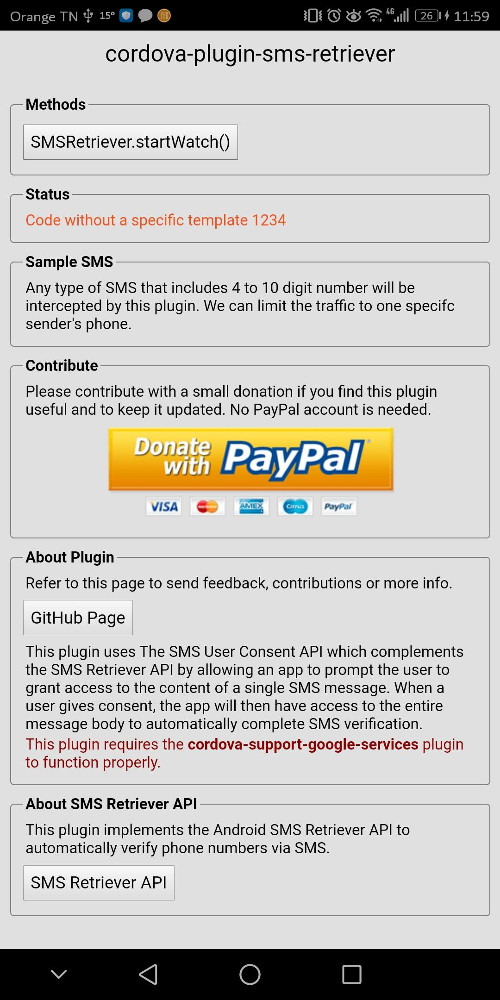

| License | Platform | Contribute |
| --- | --- | --- |
|  |  | [](https://www.paypal.com/cgi-bin/webscr?cmd=_s-xclick&hosted_button_id=G33QACCVKYD7U) |

# cordova-plugin-sms-retriever

Cordova plugin to receive verification SMS in Android using the [SMS Retriever API](https://developers.google.com/identity/sms-retriever/overview).

## Installation

Add the plugin with Cordova CLI (v6 or later):
```bash
cordova plugin add cordova-plugin-sms-retriever
```
Add the dependent [cordova-support-google-services](https://github.com/chemerisuk/cordova-support-google-services "cordova-support-google-services") plugin:
```bash
cordova plugin add cordova-support-google-services
```

## Methods

### SMSRetriever.startWatch(successCallback, failureCallback)

Start listening for a single incoming [verification SMS](https://developers.google.com/identity/sms-retriever/verify#1_construct_a_verification_message "verification SMS"). This will later raise the **onSMSArrive** event when a valid SMS arrives. Example usage:

```javascript
SMSRetriever.startWatch(function(msg) {
	// Wait for incoming SMS
	console.log(msg);
}, function(err) {
	// Failed to start watching for SMS
	console.error(err);
});
```

**Notice:** The API will timeout **5 minutes** after starting if no valid SMS has arrived. Also, the API stops listening for SMS after a valid SMS has been detected.

## Events

### onSMSArrive

Triggered when a verification SMS that includes 4 to 10 digits number. You need call **startWatch()** first. Example usage:

```javascript
document.addEventListener('onSMSArrive', function(args) {
	// SMS arrived, get its contents
	console.info(args.message);
	// To Do: Extract the received one-time code and verify it on your server
});
```

## Construct a verification SMS

We don't need The verification SMS message to follow the SMS criteria from the [SMS Verification API](https://developers.google.com/identity/sms-retriever/verify#1_construct_a_verification_message "verification SMS"):

    Be no longer than 140 bytes
    Begin with the prefix <#>
    Contain a one-time code that the client sends back to your server to complete the verification flow
    End with an 11-character hash string that identifies your app

The SMS Retriever API offers the best user experience for automating the SMS-based user verification process. However, there are situations where you don't control the format of the SMS message and cannot support the SMS Retriever API. In this case, you can use this API to streamline the process.

## Demo App

To test this plugin in a Cordova app using the provided sample:

 1. Create a blank cordova app as you regularly do.
 2. Install it following the previous instructions.
 3. Replace your `www` folder with the one provided here at the `demo` folder
 4. Start the app in your emulator or device and test the plugin.
 5. When you are satisfied, kindly send a donation using the PayPal button on this page.

## Screenshots

Here are some screens from the **SMSReceiverDemo** sample app included in the demo folder. Feel free to try this demo in whatever device you find.




## About this Plugin

### Prerequisites

This plugin requires the Google Play Services version 10.2 or newer in order to work properly. You must also install the Google Play Services support plugin as explained in the **Install** section.

### Does the plugin work in the Android emulator?

The plugin will work in your emulator as long as you are using a **Google Play** ABI or System Image, instead of the regular Google APIs ones. This is because these images include the Google Play Store and Google Play Services.

### Does the plugin still work with the app minimized?

When the app is sent to the background, as long as Android has not unloaded it to recover memory, SMS watching will remain active and working correctly for 5 minutes.

### Does the plugin require SMS permissions?

**No**, the plugin does not require any kind of permissions because it relies on the [SMS Retriever API](https://developers.google.com/identity/sms-retriever/overview "SMS Retriever API") created by Google.

### How this plugin has been tested?

I have tested this plugin with success on:

 - Android 5.1.1 emulator
 - Android 6.0 emulator
 - Android 7.1.1 emulator
 - BLU Energy Mini (Android 5.1 Lollipop)
 - BLU Vivo 5 Mini (Android 6.0 Marshmallow)
 - Samsung Galaxy I9190 (Android 4.4.2 KitKat)

## Contributing

Please consider contributing with a small **donation** using the PayPal button if you like this plugin and it works as expected. No PayPal account is needed.

[](https://www.paypal.com/cgi-bin/webscr?cmd=_s-xclick&hosted_button_id=G33QACCVKYD7U)

For support, you may post in the **GitHub Issues** section. Before reporting that *X does not work*, please compare the plugin behavior across different devices and emulators in order to locate the exact source of the problem.

## How to post Issues

If you are convinced that the plugin needs to be fixed / updated, kindly **post your issue in full detail**, including Android version, device brand and name, Cordova and cordova-android versions.

Please don't expect me to instantly reply with a magical solution or a new plugin version, but I'll try to help in whatever I can. I'm interested in mantaining this plugin in a working condition, so try to send useful, constructive feedback whenever possible.

